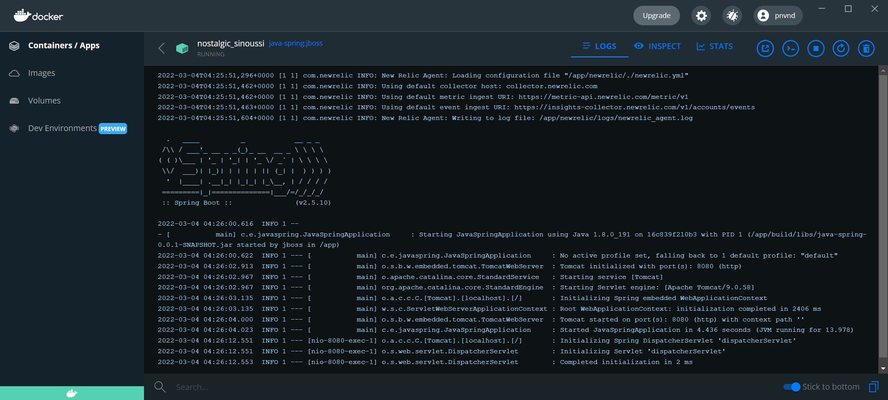

# Java Spring Application
This tutorial goes through the steps to create a Java Spring Boot application with OpenTelemetry instrumentation for New Relic.  For this specific example, (JBoss) WildFly 8.2.1 is used where `gRPC` exporter results in an error.  To get around this, the `http/protobuf` exporter is used instead.

## Prerequsites
1. Download and extract JDK 8 and append `C:\path\to\java-8\bin` to your `PATH` environment variable
2. Alternatively, build the docker container and run the image.

## Instructions
1. Go to [https://start.spring.io](https://start.spring.io) and select the following options:

    | Field         | Setting        |
    |---------------|----------------|
    | Project       | Gradle Project |
    | Language      | Java           |
    | Spring Boot   | 2.5.10         |
    | Artifact      | java-spring    |
    | Packaging     | Jar            |
    | Java          | 8              |
    | Dependencies  | Spring Web     |

2. Click `Generate` to download `java-sping.zip`.  Extract the `java-spring` folder somewhere.

3. Create a new file `Controller.java` under `src\main\java\com\example\javaspring` with the following code
    ```java
    package com.example.javaspring;

    import org.springframework.web.bind.annotation.GetMapping;
    import org.springframework.web.bind.annotation.RestController;

    @RestController
    public class Controller {

    // Step 1: Add a controller method that we can invoke to exercise the application
    @GetMapping("/ping")
    public String ping() {
        return "pong";
        }
    }
    ```

4. Edit the `build.gradle` file to add the following dependencies, comment out gRPC exporter as needed.
    ```java
    // Step 2: Add required dependencies

    // The OpenTelemetry BOM (Bill of Materials) coordinates artifact versions
    implementation platform('io.opentelemetry:opentelemetry-bom:1.10.1')
    implementation platform('io.opentelemetry:opentelemetry-bom-alpha:1.10.1-alpha')

    // The OpenTelemetry API provides APIs for instrumenting applications
    implementation 'io.opentelemetry:opentelemetry-api'

    // The OpenTelemetry SDK provides APIs configuring what happens with telemetry data
    implementation 'io.opentelemetry:opentelemetry-sdk'

    // The Autoconfigure module allows the SDK to be configured via system properties / environment variables
    implementation 'io.opentelemetry:opentelemetry-sdk-extension-autoconfigure'

    // The OTLP exporters are the standard way to export telemetry data out of the application (gRPC)
    // implementation 'io.opentelemetry:opentelemetry-exporter-otlp'
    // implementation 'io.opentelemetry:opentelemetry-exporter-otlp-metrics'

    // The OTLP exporters are the standard way to export telemetry data out of the application (http/protobuf)
    implementation 'io.opentelemetry:opentelemetry-exporter-otlp-http-trace'
    implementation 'io.opentelemetry:opentelemetry-exporter-otlp-http-metrics'

    // The OpenTelemetry Instrumentation BOM coordinates artifact versions for instrumentation code
    implementation platform('io.opentelemetry.instrumentation:opentelemetry-instrumentation-bom-alpha:1.10.0-alpha')

    // OpenTelemetry runtime metrics provides instrumentation for JVM memory usage and garbage collection
    implementation 'io.opentelemetry.instrumentation:opentelemetry-runtime-metrics'

    // OpenTelemetry Spring WebMVC provides a servlet filter for instrumenting Spring WebMVC applications
    implementation 'io.opentelemetry.instrumentation:opentelemetry-spring-webmvc-3.1'
    ```

5. Edit the `JavaSpringApplication.java` file and import the following:
    ```java
    import io.opentelemetry.api.GlobalOpenTelemetry;
    import io.opentelemetry.instrumentation.runtimemetrics.GarbageCollector;
    import io.opentelemetry.instrumentation.runtimemetrics.MemoryPools;
    import io.opentelemetry.instrumentation.spring.webmvc.SpringWebMvcTracing;
    import io.opentelemetry.sdk.autoconfigure.AutoConfiguredOpenTelemetrySdk;
    import org.springframework.context.annotation.Bean;
    import javax.servlet.Filter;
    ```
6. Also in the `JavaSpringApplication.java` file,  update the `main` method:
    ```java
    public static void main(String[] args) {
        // Step 3: Initialize OpenTelemetry using autoconfigure
        // https://github.com/open-telemetry/opentelemetry-java/tree/main/sdk-extensions/autoconfigure
        AutoConfiguredOpenTelemetrySdk.initialize();

        // Step 4: Register runtime metrics instrumentation
        // https://github.com/open-telemetry/opentelemetry-java-instrumentation/tree/main/instrumentation/runtime-metrics/library
        MemoryPools.registerObservers();
        GarbageCollector.registerObservers();

        SpringApplication.run(JavaSpringApplication.class, args);
    }
        // Step 5: Register Spring WebMVC instrumentation
        // https://github.com/open-telemetry/opentelemetry-java-instrumentation/tree/main/instrumentation/spring/spring-webmvc-3.1/library
        @Bean
        public Filter webMvcTracingFilter() {
        return SpringWebMvcTracing.create(GlobalOpenTelemetry.get()).newServletFilter();
        }
    }
    ```

6. Run the application with `.\gradlew.bat build` (Windows) or `gradlew build` (Bash)

7. The `.jar` file can be found in `build\libs\java-spring-0.0.1-SNAPSHOT.jar`

8. Before running the application, se the following environment variables
    ```powershell
    # PowerShell
    $env:OTEL_EXPORTER_OTLP_ENDPOINT="OTEL_EXPORTER_OTLP_HEADERS=api-key=XXXXXXXXXXXXXXXXXXXXXXXXXXXXXXXXXXXXNRAL"
    $env:OTEL_EXPORTER_OTLP_ENDPOINT="https://otlp.nr-data.net:4318"
    $env:OTEL_EXPORTER_OTLP_PROTOCOL="http/protobuf"
    $env:OTEL_RESOURCE_ATTRIBUTES="service.name=java-spring.otel,service.instance.id=localhost"
    $env:OTEL_METRICS_EXPORTER="otlp"
    $env:OTEL_METRIC_EXPORT_INTERVAL="1000"
    ```
    ```bash
    # Bash
    export OTEL_EXPORTER_OTLP_ENDPOINT=OTEL_EXPORTER_OTLP_HEADERS=api-key=XXXXXXXXXXXXXXXXXXXXXXXXXXXXXXXXXXXXNRAL
    export OTEL_EXPORTER_OTLP_ENDPOINT=https://otlp.nr-data.net:4318
    export OTEL_EXPORTER_OTLP_PROTOCOL=http/protobuf
    export OTEL_RESOURCE_ATTRIBUTES=service.name=java-spring.otel,service.instance.id=localhost
    export OTEL_METRICS_EXPORTER=otlp
    export OTEL_METRIC_EXPORT_INTERVAL=1000
    ```

9. If you have JDK 8, run the application from a terminal:
    ```
    java -jar build\libs\java-spring-0.0.1-SNAPSHOT.jar
    ```

10. If you want to build the container instead, edit the `Dockerfile` with your New Relic INGEST - LICENSE key and save before running the following commands:
    ```
    docker build -t java-spring:jboss . 
    docker run -d -p 8080:8080 java-spring:jboss
    ```

11. Go to [http://127.0.0.1:8080/ping](http://127.0.0.1:8080/ping) and generate some traffic.

12. Go to `New Relic One > Services - OpenTelemetry > java-spring.otel` to see telemetry data.

## New Relic Instrumentation
1. If you also need to instrument the application with New Relic, simply download and extract the Java Agent to the root of this project: https://download.newrelic.com/newrelic/java-agent/newrelic-agent/current/newrelic-java.zip

2. Edit the `newrelic.yml` file to change the `license_key` and `app_name`.

3. To run the app from your terminal, make sure your environment variables are set, then run:
    ```
    java -javaagent:newrelic/newrelic.jar -jar build\libs\java-spring-0.0.1-SNAPSHOT.jar
    ```

4. Otherwise, to run this in Docker, edit the `Dockerfile` and change the `ENTRYPOINT` to:
    ```
    ENTRYPOINT ["java", "-javaagent:newrelic/newrelic.jar", "-jar", "build/libs/java-spring-0.0.1-SNAPSHOT.jar"]
    ```

5. Build the Docker image and run:
    ```
    docker build -t java-spring:jboss . 
    docker run -d -p 8080:8080 java-spring:jboss
    ```
6. Go to [http://127.0.0.1:8080/ping](http://127.0.0.1:8080/ping) and generate some traffic.

7. Go to `New Relic One > Services - APM > java-spring.docker` to see data ingested into New Relic.

8. Both OpenTelemetry and New Relic agent is running, check out the data from both in New Relic to see the differences.

    